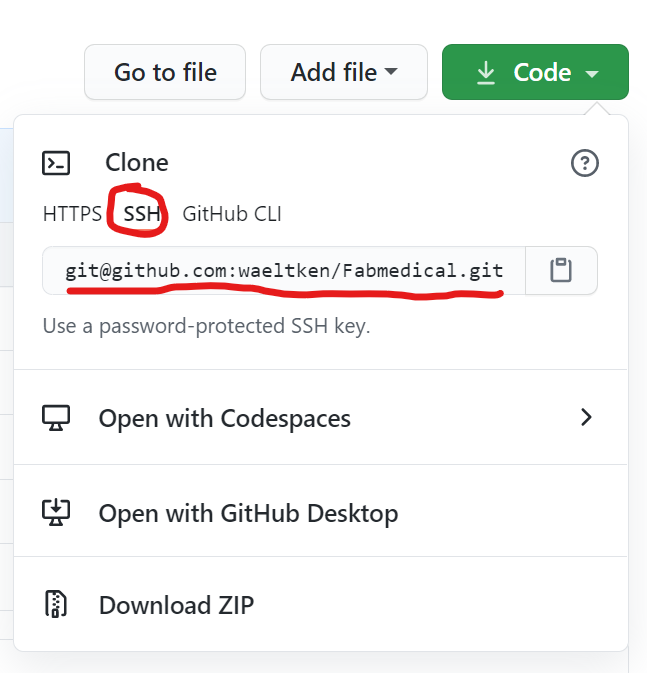
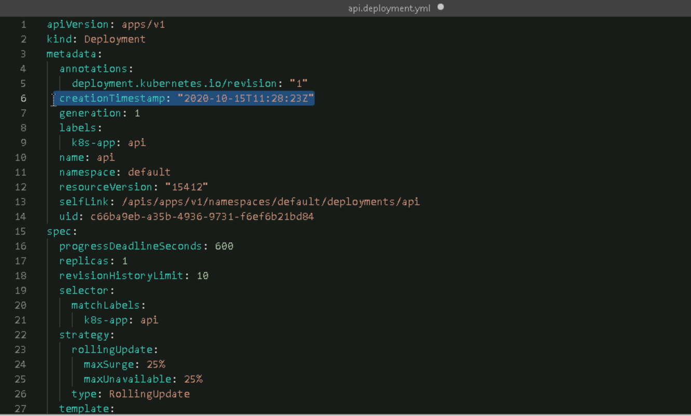

# Quickstart the workshop

Instead of initializing your own repositroy you can just fork this one to you
own github account.

## Quickstart on day 1

This get's you started faster the before hands on lab section.

### Create the lab environment

You should have received an access link and activiation code
to create your very own lab environment for this workshop.

Use these credentials to create your environment **now**, it will take some time.

### Fork the prepared initial commit

[Create a fork of this repository, by clicking here.](https://github.com/waeltken/Fabmedical/fork)

> Make sure you fork into your private account.

### Setup Azure Cloud Shell

Log into the Azure Portal on the provided virtual machine. The crendentials are in the lab environemnt.


If you get an error message use the advanced options, select `westeurope` as region and unique names for the storage account and file storage.

### Connect to the build agent

You can find the description on how to connect to the build agent [here](https://github.com/microsoft/MCW-Cloud-native-applications/blob/master/Hands-on%20lab/Before%20the%20HOL%20-%20Cloud-native%20applications.md#task-8-connect-securely-to-the-build-agent).

> Everything related to docker and excercise 1 takes place in the build agent.

### Clone the reposity to the build agent

Once connected to the build agent please run the following three lines to
generate a new ssh-key:

```shell
rm ~/.ssh/id_rsa
rm ~/.ssh/id_rsa.pub
ssh-keygen
```

Please keep the default location for the new key and leave the password blank.
(Just hit `<return>` a few times.)

Then copy the public part of [your key to github](https://github.com/settings/keys) for you to be able to authenticate using the access credentials.

```shell
cat ~/.ssh/id_rsa.pub
```

> Make sure to use the git instead of the https connection for further steps.



Now you should be able to clone your fork of the Fabmedical repository to the build agent.

## Resume on day 2

The lab environments are deleted after 8 hours. Everything you've done yesterday inside the lab environment is lost. But worry not, the most important results of you work should have been commited and pushed to your github account.

Having finished exercise 1 we will no longer need the build agent. Everything from now on will take place in the Azure Cloud Shell.

### Clone your fork of the repositoy

As we did yesterday on the build agent we now need the sourcecode in the cloudshell. Please go ahead an clone your fork of the repository into your cloud shell account.

> It might be necessery to create a new ssh-key and store it in your github account.

### Get the docker images ready again

We provide pre-build docker images of the sample application for you. The
respective images are called:

`waeltken/fabmedical-content-api:latest`

`waeltken/fabmedical-content-web:latest`

`waeltken/fabmedical-content-init:latest`


These images are available publicly.

To reuse your own build-pipeline form exercise one of the workshop need to take following steps:

1. Update the secrets for the container registry in your github repository.
2. Update all 3 build pipelines yaml files with the correct values for the new
   container registry.
3. Run the build pipelines again.

> If you've already started with day 2 you might also need to download the access
> credentials for the kubernetes cluster and deploy your services again.

## FAQ and pitfals

Q: In `Exercise 2 - Task 2 - Step 16` when I try to apply the updated template a get an error message, what's wrong?

A: The guide is missing a hint that you need to delete the `resourceVersion`
metadata from your yaml file. 
